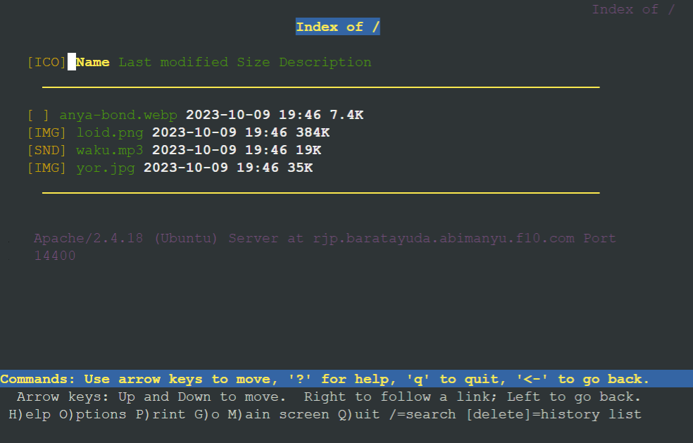
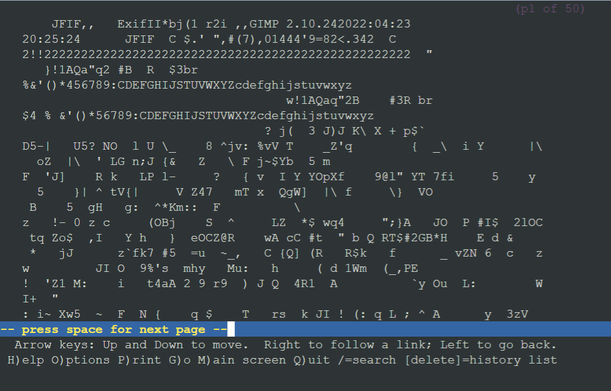

# Jarkom-Modul-2-F10-2023
Laporan resmi praktikum modul 2 gns, dns, &amp; web server mata kuliah jaringan komputer
Kelompok: F10 <br />
Nama anggota 1: Radhiyan M Hisan <br />
NRP anggota 1: 5025211166 <br />
Nama anggota 2: Thoriq Afif Habibi <br />
NRP anggota 2: 5025211154 <br />

## 11. Konfigurasi web www.abimanyu.f10.com dengan Apache Web Server dan DocumentRoot di /var/www/abimanyu.f10
Konfigurasi www.abimanyu.f10.com menggunakan skrip abimanyuConf.sh dengan langkah-langkah berikut:
1. Menyalin konfigurasi default apache (file 000-default.conf) pada folder "/etc/apache2/sites-available" dengan nama file "abimanyu.f10.conf" ke folder yang sama dengan command `cp`
2. Mendownload resource dari google drive dan unzip ke folder "/var/www/abimanyu.f10" sebagai document root dengan command `wget` dan `unzip`
3. Membuat konfigurasi virtualHost dengan "DocumentRoot /var/www/abimanyu.f10", "ServerName abimanyu.f10.com", dan "ServerAlias www.abimanyu.f10.com" dengan menaruh ke variabel `conf` dan dituliskan ke file "abimanyu.f10.conf"
4. Mengaktifkan konfigurasi dengan perintah `a2ensite abimanyu.f10`
5. Merestart web server apache2  dengan perintah `service apache2 restart`

Untuk melakukan testing, saya mengakses web dengan `lynx abimanyu.f10.com/abimanyu.webp` `lynx abimanyu.f10.com/home.html` pada klien. Hasil yang diberikan sebagai berikut:<br>

- home.html<br>
<br />
- abimanyu.webp<br>
<br />

## 13. Konfigurasi web www.parikesit.abimanyu.f10.com degan DocumentRoot di /var/www/parikesit.abimanyu.f10
Konfigurasi www.parikesit.abimanyu.f10.com menggunakan skrip parikesitConf.sh dengan langkah-langkah berikut:
1. Menyalin konfigurasi default apache (file 000-default.conf) pada folder "/etc/apache2/sites-available" dengan nama file "parikesit.abimanyu.f10.conf" ke folder yang sama dengan command `cp`
2. Mendownload resource dari google drive dan unzip ke folder "/var/www/parikesit.abimanyu.f10" sebagai document root dengan command `wget` dan `unzip`
3. Membuat folder `/secret` di dalam folder "/var/www/parikesit.abimanyu.f10" dengan command `mkdir`
4. Membuat konfigurasi virtualHost dengan "DocumentRoot /var/www/parikesit.abimanyu.f10", "ServerName parikesit.abimanyu.f10.com", dan "ServerAlias www.parikesit.abimanyu.f10.com" dengan menaruh ke variabel `conf` dan dituliskan ke file "abimanyu.f10.conf"
5. Mengaktifkan konfigurasi dengan perintah `a2ensite parikesit.abimanyu.f10`
6. Merestart web server apache2  dengan perintah `service apache2 restart`

Untuk melakukan testing, saya mengakses web dengan `lynx parikesit.abimanyu.f10.com` di klien dengan hasil:

<br />

## 14. Pada www.parikesit.abimanyu.f10.com, folder /public hanya dapat melakukan directory listing dan folder /secret tidak dapat diakses (403 forbidden)
Pengaktifan directory listing pada folder `public` dan pembatasan akses pada folder `secret` dapat dilakukan dengan menambahkan konfigurasi berikut pada konfigurasi virtualHost file `parikesit.abimanyu.f10.conf`:
```R
<Directory /var/www/parikesit.abimanyu.f10/public>
		Options +Indexes
</Directory>

<Directory /var/www/parikesit.abimanyu.f10/secret>
	Options -Indexes
</Directory>
```
Agar konfigurasi yang baru aktif, saya juga melakukan restart service apache2<br>
Untuk melakukan testing, saya mengakses folder public dan secret melalui klien dengan hasil:<br>

- lynx parikesit.abimanyu.f10.com/public<br>
<br />
- lynx parikesit.abimanyu.f10.com/secret<br>
<br />

## 15. Kustomisasi halaman error pada parikesit.abimanyu.f10.com
Pada soal ini, halaman error yang muncul akan diubah dengan file html yang ada pada folder `/error`. Pengubahan halaman error ini dapat dilakukan dengan menambahkan hal berikut pada konfigurasi virtualHost file `parikesit.abimanyu.f10.conf`:
```R
ErrorDocument 403 /error/403.html
ErrorDocument 404 /error/404.html
```
Agar konfigurasi yang baru aktif, saya juga melakukan restart service apache2<br>
Untuk melakukan testing, saya mencoba mengakses "parikesit.abimanyu.f10.com/secret" dan "parikesit.abimanyu.f10.com/yyy" sebagai error 403 dan 404. Hasil yang didapatkan adalah sebagai berikut:<br>

- lynx parikesit.abimanyu.f10.com/secret (error 403)<br>
<br />
- lynx parikesit.abimanyu.f10.com/yyy (error 404)<br>
<br />

## 16. File asset www.parikesit.abimanyu.yyy.com/public/js menjadi www.parikesit.abimanyu.yyy.com/js
Directory alias "www.parikesit.abimanyu.yyy.com/js" dapat dibuat dengan menambahkan hal berikut pada konfigurasi virtualHost file `parikesit.abimanyu.f10.conf`:
```R
Alias \"/js\" \"/var/www/parikesit.abimanyu.f10/public/js\"
```
Agar konfigurasi yang baru aktif, saya juga melakukan restart service apache2<br>
Untuk melakukan testing, saya mencoba mengakses "parikesit.abimanyu.f10.com/public/js" dan "parikesit.abimanyu.f10.com/js". Berdasarkan gambar di bawah, dapat dilihat bahwa hasil sama yang menandakan bahwa directory alias telah aktif:<br>

- lynx parikesit.abimanyu.f10.com/public/js<br>
<br />
- lynx parikesit.abimanyu.f10.com/js<br>
<br />

## 17. Konfigurasi rjp.baratayuda.abimanyu.f10.com hanya dapat diakses melaui port 14000 dan 14400
Konfigurasi rjp.baratayuda.abimanyu.f10.com menggunakan skrip rjpConf.sh dengan langkah-langkah berikut:
1. Menyalin konfigurasi default apache (file 000-default.conf) pada folder "/etc/apache2/sites-available" dengan nama file "rjp.baratayuda.abimanyu.f10.conf" ke folder yang sama dengan command `cp`
2. Mendownload resource dari google drive dan unzip ke folder "/var/www/abimanyu.f10" sebagai document root dengan command `wget` dan `unzip`
3. Membuat konfigurasi virtualHost dengan "DocumentRoot /var/www/abimanyu.f10", "ServerName abimanyu.f10.com", dan "ServerAlias www.abimanyu.f10.com" dengan menaruh ke variabel `conf` dan dituliskan ke file "abimanyu.f10.conf"
4. Pada konfigurasi virtualHost, definisikan port agar hanya dapat diakses pada 14000 dan 14400 dengan `<VirtualHost *:14000 *:14400>`
5. Ubah konfigurasi port pada "/etc/apache2/ports.conf" dengan menambahkan `Listen 14000` dan `Listen 14400`
6. Mengaktifkan konfigurasi dengan perintah `a2ensite rjp.baratayuda.abimanyu.f10`
7. Merestart web server apache2  dengan perintah `service apache2 restart`

Untuk melakukan testing, saya mencoba akses "rjp.baratayuda.abimanyu.f10.com", "rjp.baratayuda.abimanyu.f10.com:14000", dan "rjp.baratayuda.abimanyu.f10.com:14400" dengan hasil:

- lynx rjp.baratayuda.abimanyu.f10.com<br>
<br />
- lynx rjp.baratayuda.abimanyu.f10.com:14000<br>
<br />
- lynx rjp.baratayuda.abimanyu.f10.com:14400<br>
<br />

## 18. Menambahkan autentikasi pada rjp.baratayuda.abimanyu.f10.com dan meletakkan documentRoot di /var/www/rjp.baratayuda.abimanyu.f10
Penambahan autentikasi pada rjp.baratayuda.abimanyu.f10.com menggunakan skrip makeAuth.sh dengan langkah-langkah berikut:
1. Membuat username `wayang` dan `password` yang diletakkan pada file "/etc/apache2/.htpasswd" dengan command "echo "baratayudaf10" | htpasswd -ci /etc/apache2/.htpasswd Wayang"
2. Mengaktifkan mode autentikasi dengan command "a2enmod auth_basic" dan "a2enmod authn_file"
3. Menambahkan skrip berikut pada konfigurasi virtualHost file "rjp.baratayuda.abimanyu.f10.conf"
```R
<Directory /var/www/rjp.baratayuda.abimanyu.f10>
	AuthType Basic
	AuthName "Private Area"
	AuthUserFile /etc/apache2/.htpasswd
	Require valid-user
</Directory>
```
4. Merestart web server apache2  dengan perintah `service apache2 restart`

Untuk melakukan testing, saya mencoba akses kembali "rjp.baratayuda.abimanyu.f10.com" yang kemudian meminta username dan password seperti berikut:

- Meminta username<br>
<br />
- Meminta password<br>
<br />

## 19. Akses IP abimanyuWebServer dialihkan ke www.abimanyu.f10.com
Akses IP akan mengikuti konfigurasi default sehingga pengalihan ke abimanyu.f10.com dapat dilakukan dengan mengubah konfigurasi default menjadi:
```R
<VirtualHost *:80>
    ServerAdmin webmaster@localhost
    DocumentRoot /var/www/abimanyu.f10
	ServerName abimanyu.f10.com

    ErrorLog \${APACHE_LOG_DIR}/error.log
    CustomLog \${APACHE_LOG_DIR}/access.log combined

</VirtualHost>

# vim: syntax=apache ts=4 sw=4 sts=4 sr noet
```

Untuk melakukan testing, saya menjalankan "lynx 192.226.3.3/home.html" pada klien dengan hasil:<br>
<br />

## 20. Mengalihkan request gambar dengan substring "abimanyu" ke abimanyu.png
Pengalihan request gambar ke abimanyu.png menggunakan skrip redirectImage.sh dengan langkah-langkah berikut:
1. Menambahkan hal berikut ke konfigurasi virtualHost file "parikesit.abimanyu.f10.conf"
```R
<Directory /var/www/parikesit.abimanyu.f10>
	Options +FollowSymLinks -Multiviews
	AllowOverride All
</Directory>
```
2. Membuat file `.htaccess` pada folder "/var/www/parikesit.abimanyu.f10"
3. Mengaktifkan rewrite engine dengan menambahkan "RewriteEngine On" ke file `.htaccess`
4. Menambahkan rewrite condition untuk memilih request yang akan di-rewrite. Kondisi yang di-rewrite adalah request yang mengandung "abimanyu", request berekstensi "jpeg, jpg, png, atau gif", dan bukan merupakan request ke abimanyu.png. Kondisi ini dapat diterapkan dengan menambah kode berikut ke file `.htaccess`
```R
RewriteCond %{REQUEST_URI} abimanyu [NC]
RewriteCond %{REQUEST_URI} \.(jpg|jpeg|png|gif)$ [NC]
RewriteCond %{REQUEST_URI} !/public/images/abimanyu.png
```
5. Mengarahkan request yang memenuhi semua kondisi di atas dengan menambahkan "RewriteRule ^(.*)$ /public/images/abimanyu.png [R=301,L]" ke `.htaccess`

Untuk melakukan testing, saya mencoba akses "abimanyu-student.jpg" dan "notabimanyujustmuseum.177013":

- lynx parikesit.abimanyu.f10.com/public/images/abimanyu-student.jpg<br>
<br />
- lynx parikesit.abimanyu.f10.com/public/images/notabimanyujustmuseum.177013<br>
<br />

## Kendala
- file index.php pada abimanyu.f10.com tidak dapat dibaca sehingga ketika diakses, tidak diarahkan ke home.html seperti pada logika di skripnya. Namun, akses ke file `home.html` secara langsung dapat memunculkan isi dari file html.

## Revisi
- Nomor 20: Penambahan perintah "a2enmod rewrite" pada skrip redirectImage.sh untuk mengaktifkan modul rewrite. Pada saat praktikum, saya mengaktifkan di terminal tanpa memasukkan ke skrip.